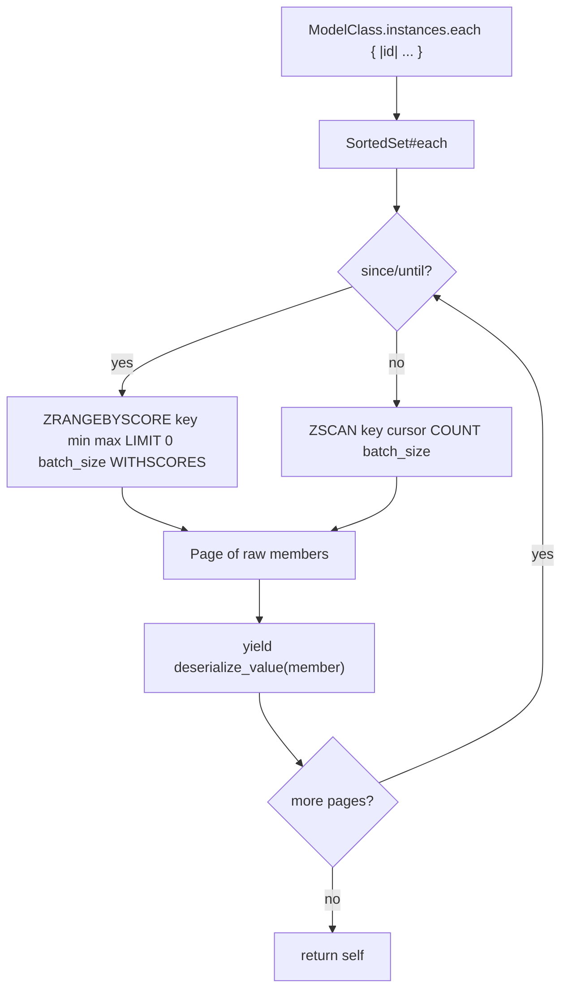
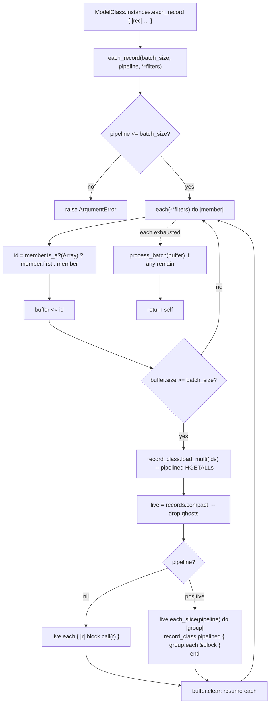

# docs/guides/datatype-collections.md
---

# DataType - Collection classes

UnsortedSet, Sorted Set, List, and Hash data types all include the `Collection` module, which provides two main iteration methods: `each` and `each_record`. Both methods are designed to efficiently handle large collections by paginating through Valkey/Redis data structures, but they serve different purposes and yield different results.

Here's how the two methods iterate, using `ModelClass.instances` (a `SortedSet` with `reference: true`) as the running example.

## `each` — yields **members** (identifiers, raw strings)

`each` is implemented per type. For the `instances` SortedSet, it pages through the ZSET with either `ZRANGEBYSCORE` (when `since:`/`until:` are given) or `ZSCAN` (unbounded), yielding one deserialized member at a time.



Per-type variations:
- `ListKey#each` — paginates with `LRANGE start stop` (no SCAN equivalent)
- `UnsortedSet#each` / `HashKey#each` — `SSCAN` / `HSCAN`, optional `matching:` glob
- `SortedSet#each` — `ZRANGEBYSCORE` (bounded) or `ZSCAN` (unbounded)

You get **identifiers only**. No record loading. One Redis round-trip per page.

## `each_record` — yields **loaded Horreum records**

`each_record` is defined once in `CollectionBase` and delegates to `each` to collect identifiers, then batches them into `record_class.load_multi` (pipelined `HGETALL`s), filters ghosts, and yields the live records.



### Concrete timeline for `User.instances.each_record(batch_size: 100, pipeline: 25) { |u| u.touch! }`

```
SortedSet#each (ZSCAN page 1, 100 ids)
   ├─ buffer fills to 100
   ├─ load_multi(ids)        → 1 pipeline of 100 HGETALLs
   ├─ compact ghosts          → e.g. 97 live records
   ├─ slice(25):
   │     pipelined { 25 × u.touch! }   ← 1 Redis pipeline
   │     pipelined { 25 × u.touch! }   ← 1 Redis pipeline
   │     pipelined { 25 × u.touch! }   ← 1 Redis pipeline
   │     pipelined { 22 × u.touch! }   ← 1 Redis pipeline
   └─ buffer.clear
SortedSet#each (ZSCAN page 2, 100 ids)
   └─ … repeat …
SortedSet#each exhausted
   └─ flush any remaining buffered ids the same way
```

## Key differences

| Aspect | `each` | `each_record` |
|---|---|---|
| Yields | raw identifier (or `[field, value]` for `HashKey`) | loaded Horreum instance |
| Redis ops per yield | 0 extra (already paged) | amortized `HGETALL` via `load_multi` batch |
| Requires `reference: true` + `:class` | no | yes (raises `Familia::Problem` otherwise) |
| Ghost handling | yields the dangling id | `compact` drops them silently |
| Write pipelining | not built-in | `pipeline:` groups block-body writes into `pipelined` blocks |
| Filters | type-specific (`since:`, `matching:`, …) | forwarded to underlying `each` |

So `each_record` is a thin orchestration layer: it leans on the type's own `each` for read pagination, then layers (1) batched record hydration and (2) optional write pipelining on top.

## Choosing a `pipeline` mode

`each_record` has two dispatch modes, controlled by `pipeline:`. The parameter answers a single question: **may the dispatch loop wrap your block in a `pipelined { }`?**

| Value | Dispatch | Use when the block… |
|---|---|---|
| `nil` (default) | Each record runs in its own connection context, no pipeline wrapper | …reads, OR calls `save` / `commit_fields` / `transaction` / anything with its own internal MULTI |
| positive integer | Groups of `pipeline` records run inside `record_class.pipelined { ... }` | …only issues fast writers (`record.field!`) that tolerate being queued |

Note: `pipeline: 0` raises `ArgumentError`. Use `pipeline: nil` to disable pipelining.

The read-only case and the serial-write case collapse into the same mode because both require **immediate** execution with real return values. Wrapping `save` in an outer `pipelined` would either return `Redis::Future` objects or raise `ConflictingContextError` when `save`'s internal transaction tries to open.

### The three idiomatic patterns

```ruby
# 1. Read-only iteration — the default (pipeline: nil) is correct
User.instances.each_record do |user|
  puts "#{user.email} #{user.last_login}"
end

# 2. Serial writes — the default (pipeline: nil) is required for save / commit_fields / transaction
User.instances.each_record do |user|
  user.score = recompute(user)
  user.save
end

# 3. Pipelined fast writers — opt-in optimization
User.instances.each_record(pipeline: 50) do |user|
  user.last_seen_at! Familia.now   # single HSET, safe to queue in pipeline
end
```

### Pipelining footgun

If you enable pipelining and your block reads from a related collection (e.g. `user.sessions.size`), that read is queued into the pipeline and returns a `Redis::Future` rather than a value. Omit the `pipeline:` parameter (or explicitly pass `pipeline: nil`) whenever the block needs real return values from Redis.
